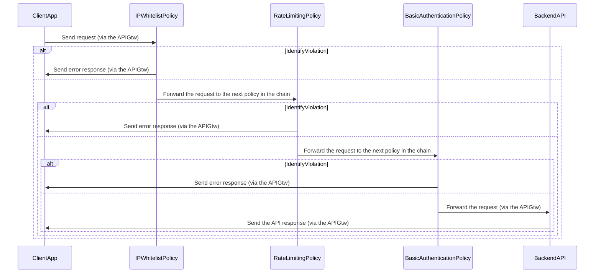
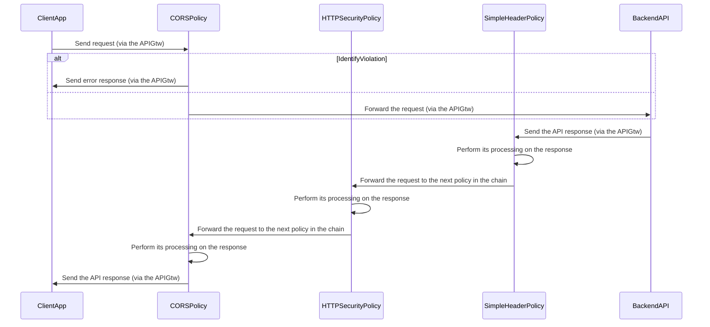

# Post MERMAID schemas

## Settings

Theme is **forest** in *Mermaid Configuration* section:

```json
{"theme":"forest"}
```

To obtain a PNG follow these steps:

1. Use the *Mermaid code* in the [Live Editor](https://mermaid-js.github.io/mermaid-live-editor).
2. Set the **forest** theme
3. Download the **SVG** image.
4. Open the file with **EDGE**.
5. Use the *Web capture* option to select the zone to keep as image.
6. Use Paint to save the clipboard to a **PNG** file.
7. Name the image file `FigureXX.png` where XX is the number with 0 padding on 2 positions.

:bulb: Point 3 to 6 can be replaced by a direct printscreen of the rendered schema if it fit a screen.

## Mermaid code for schemas

### Figure01


### Figure 02


### Figure 03


### Figure 06

#### API Published



### Figure 07

#### API Public


